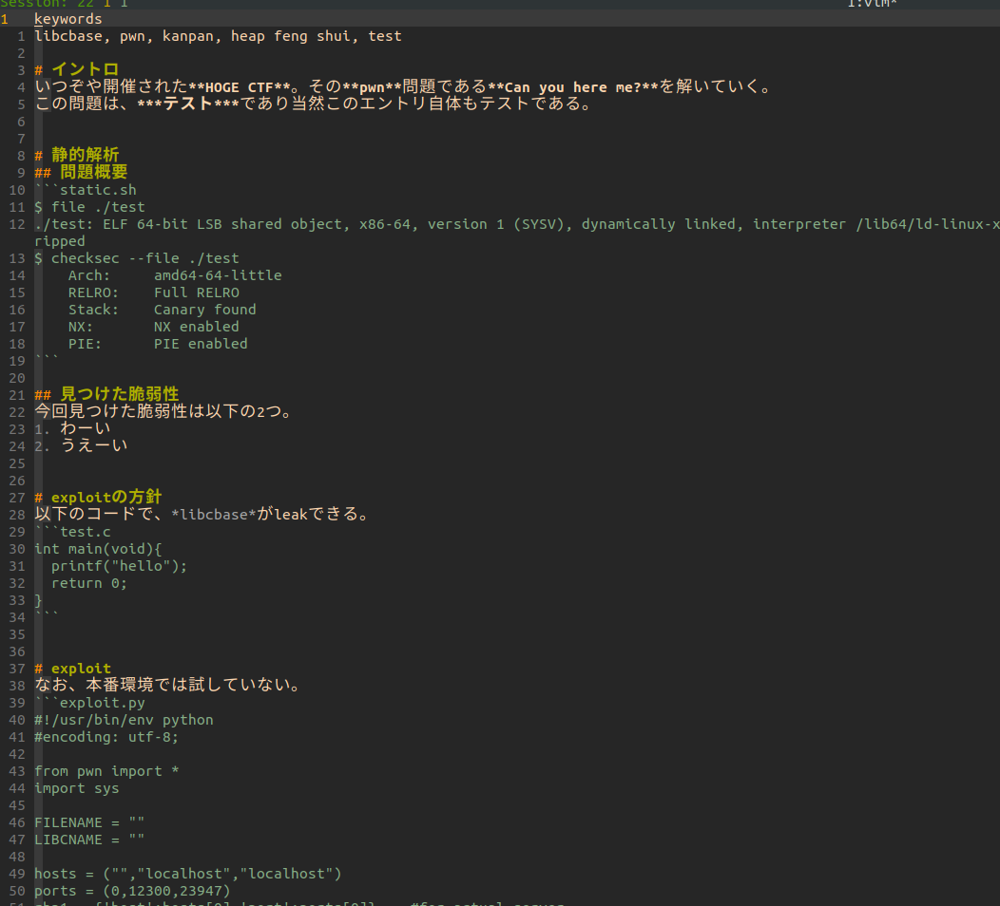
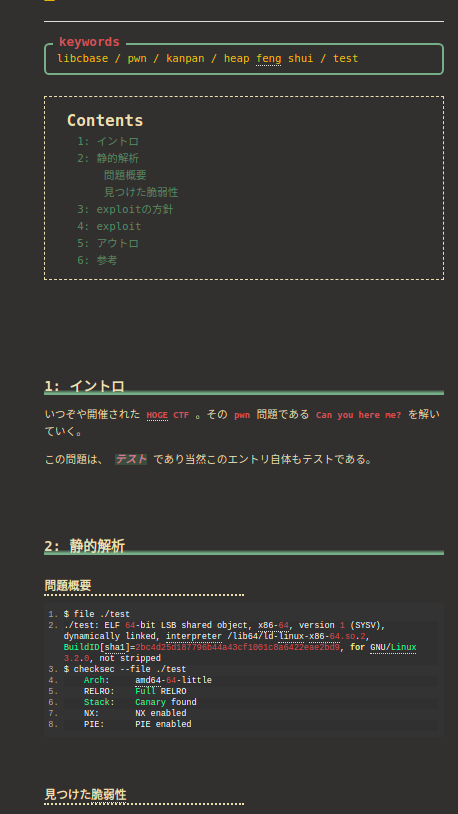

# Markdown to HTML converter
Markdown to HTML converter especially for Hatena blog.  
The only target is me.  

## Functionalities
- Header convertion
  - `#` is converted to `<h3>` and others are...
- Auto indexing of headers
- codeblock
  - pretty-print it depending on its extension.
- Footer
- etc...

## Files
- `md2html.py`: converter
- `md2html`: run-script

## Markdwon

## HTML

## Blog itself and archives
- https://smallkirby.hatenablog.com/archive
- https://github.com/smallkirby/hatena-archives
